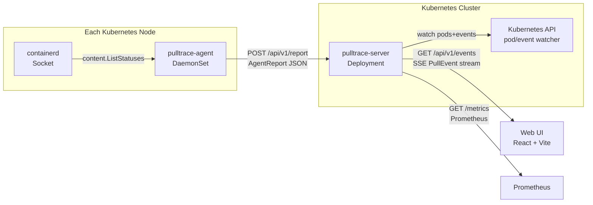

# Phase 2: Documentation Site - Research

**Researched:** 2026-02-23
**Domain:** MkDocs Material, GitHub Pages CI deployment, technical writing for Kubernetes tools
**Confidence:** HIGH

## Summary

Phase 2 builds a public documentation site at `https://d44b.github.io/pulltrace/` using MkDocs Material
9.7.2. The site covers installation, configuration, architecture, Prometheus metrics, known limitations,
and contributing — everything a stranger needs to install Pulltrace without reading source code. Content
is already well-documented in README.md, ADRs, values.yaml, and source env-var tables; the work is
primarily organization and structure rather than discovery.

The key infrastructure decision (already locked in STATE.md) is that deployment MUST use
`peaceiris/actions-gh-pages@v4` with `keep_files: true`, NOT `mkdocs gh-deploy --force`. The
`gh-deploy --force` approach nukes the entire gh-pages branch on every deploy, which would destroy the
`/charts/` directory that Phase 3 will place there. The two-workflow co-deployment pattern
(`docs.yml` for MkDocs content, Phase 3's `helm-pages` job for chart index) is the only safe
co-location pattern for this repository.

MkDocs Material 9.7.2 is the current latest release (February 2026) and remains the dominant K8s
ecosystem documentation standard. Note: MkDocs 2.0 (a ground-up rewrite) was announced in February
2026 but is incompatible with MkDocs Material 9.x — pin to MkDocs Material 9.7.2 explicitly to avoid
auto-upgrading into an incompatible major version.

**Primary recommendation:** Scaffold with `mkdocs.yml` + `docs/` tree in plan 02-01, then write all
content in plan 02-02. Use `peaceiris/actions-gh-pages@v4` with `keep_files: true` for the deploy
step. Pin `mkdocs-material==9.7.2`.

<phase_requirements>
## Phase Requirements

| ID | Description | Research Support |
|----|-------------|-----------------|
| DOCS-01 | User can browse a documentation site at `https://d44b.github.io/pulltrace/` (GitHub Pages, MkDocs Material theme) | mkdocs.yml scaffold + docs.yml CI workflow using peaceiris/actions-gh-pages@v4 |
| DOCS-02 | Docs site has an Installation page with `helm repo add` command, `helm install` command, and prerequisites listed | Content sourced from README.md Quick Start section + values.yaml; helm commands are in README |
| DOCS-03 | Docs site has a Configuration reference page covering all environment variables for both server and agent | Server env vars from server.go ConfigFromEnv(); agent env vars from agent.go ConfigFromEnv() — both fully enumerated |
| DOCS-04 | Docs site has an Architecture page explaining the agent+server+UI data flow with a diagram | ASCII diagram in README.md is the source; Mermaid flowchart is the standard MkDocs Material approach |
| DOCS-05 | CI workflow automatically deploys updated docs to GitHub Pages on every push to `main` | docs.yml workflow triggers on `push: branches: [main]` with peaceiris/actions-gh-pages@v4 + keep_files: true |
</phase_requirements>

## Standard Stack

### Core

| Library | Version | Purpose | Why Standard |
|---------|---------|---------|--------------|
| mkdocs-material | 9.7.2 (pin exactly) | Documentation site theme and build tool | Dominant K8s ecosystem docs standard; used by kubectl, Helm, Argo, Flux, Karpenter |
| Python | 3.12 (via actions/setup-python@v5) | Runtime for mkdocs-material pip install | Only runtime required |

### Supporting

| Library | Version | Purpose | When to Use |
|---------|---------|---------|-------------|
| pymdownx.superfences | bundled with mkdocs-material | Enables Mermaid diagram code fences | Required for architecture diagram on DOCS-04 |
| pymdownx.tabbed | bundled with mkdocs-material | Tabbed code blocks | Optional — use for multi-method install steps |
| pymdownx.highlight | bundled with mkdocs-material | Syntax highlighting for code blocks | Enabled by default with material theme |
| actions/cache@v4 | v4 | Cache pip packages for faster CI | Cuts ~20s from deploy workflow |

### GitHub Actions Workflow Components

| Action | Version | Purpose |
|--------|---------|---------|
| actions/checkout@v4 | v4 | Checkout source |
| actions/setup-python@v5 | v5 | Install Python 3.x |
| actions/cache@v4 | v4 | Cache ~/.cache (pip downloads) |
| peaceiris/actions-gh-pages | v4 | Push built site to gh-pages branch with keep_files |

### Alternatives Considered

| Instead of | Could Use | Tradeoff |
|------------|-----------|----------|
| peaceiris/actions-gh-pages | mkdocs gh-deploy --force | `gh-deploy` nukes the entire gh-pages branch, destroying /charts/; peaceiris with keep_files is the only safe co-location pattern |
| peaceiris/actions-gh-pages | actions/upload-pages-artifact + actions/deploy-pages | Newer GitHub Pages API approach, but cannot safely co-locate docs + Helm charts in subdirectories |
| mkdocs-material 9.7.2 | MkDocs 2.0 | MkDocs 2.0 (announced Feb 2026) is a breaking rewrite; Material 9.x is incompatible with it — pin explicitly |
| Mermaid (native) | mermaid2 plugin | Mermaid2 plugin adds extra dep; native superfences integration is built into material 9.x with no extra packages |

**Installation (docs.yml pip install):**
```bash
pip install mkdocs-material==9.7.2
```

**No requirements.txt needed** — single pinned install line in the workflow is sufficient for a docs-only project.

## Architecture Patterns

### Recommended Project Structure

```
docs/                       # MkDocs source (already exists as empty dir)
  index.md                  # Home page
  installation.md           # DOCS-02: helm repo add, install, prerequisites
  configuration.md          # DOCS-03: all env vars, server + agent
  architecture.md           # DOCS-04: Mermaid diagram + data flow prose
  prometheus.md             # Prometheus metrics reference
  known-limitations.md      # Limitations section (from README)
  contributing.md           # Link/mirror to CONTRIBUTING.md
mkdocs.yml                  # MkDocs configuration at repo root
.github/
  workflows/
    ci.yml                  # Existing (do NOT modify in this phase)
    docs.yml                # New — builds and deploys docs on push to main
```

### Pattern 1: mkdocs.yml Scaffold

**What:** Minimal configuration that enables Material theme, Mermaid, and nav structure
**When to use:** Always — this is the single source of truth for the site

```yaml
# Source: https://squidfunk.github.io/mkdocs-material/
site_name: Pulltrace
site_url: https://d44b.github.io/pulltrace/
site_description: Real-time Kubernetes image pull progress monitor
site_author: d44b
repo_url: https://github.com/d44b/pulltrace
repo_name: d44b/pulltrace

theme:
  name: material
  palette:
    - scheme: default
      primary: indigo
      accent: indigo
      toggle:
        icon: material/brightness-7
        name: Switch to dark mode
    - scheme: slate
      primary: indigo
      accent: indigo
      toggle:
        icon: material/brightness-4
        name: Switch to light mode
  features:
    - navigation.tabs
    - navigation.sections
    - navigation.top
    - content.code.copy

markdown_extensions:
  - pymdownx.highlight:
      anchor_linenums: true
  - pymdownx.superfences:
      custom_fences:
        - name: mermaid
          class: mermaid
          format: !!python/name:pymdownx.superfences.fence_code_format
  - pymdownx.tabbed:
      alternate_style: true
  - admonition
  - pymdownx.details
  - attr_list
  - tables

nav:
  - Home: index.md
  - Installation: installation.md
  - Configuration: configuration.md
  - Architecture: architecture.md
  - Prometheus: prometheus.md
  - Known Limitations: known-limitations.md
  - Contributing: contributing.md
```

### Pattern 2: docs.yml CI Workflow

**What:** Separate GitHub Actions workflow that deploys docs on every push to main
**When to use:** This is the only safe pattern — separate workflow from ci.yml, triggers main-only

```yaml
# Source: verified against peaceiris/actions-gh-pages README + MkDocs Material publishing guide
name: Docs

on:
  push:
    branches: ["main"]

permissions:
  contents: write   # required by peaceiris/actions-gh-pages to push gh-pages branch

jobs:
  deploy:
    runs-on: ubuntu-latest
    steps:
      - uses: actions/checkout@v4

      - uses: actions/setup-python@v5
        with:
          python-version: "3.12"

      - name: Cache pip
        uses: actions/cache@v4
        with:
          key: mkdocs-${{ hashFiles('requirements-docs.txt') }}
          path: ~/.cache
          restore-keys: mkdocs-

      - name: Install MkDocs Material
        run: pip install mkdocs-material==9.7.2

      - name: Build docs
        run: mkdocs build --strict --site-dir site

      - name: Deploy to GitHub Pages
        uses: peaceiris/actions-gh-pages@v4
        with:
          github_token: ${{ secrets.GITHUB_TOKEN }}
          publish_dir: ./site
          publish_branch: gh-pages
          keep_files: true          # CRITICAL: preserves /charts/ placed by Phase 3
          destination_dir: "."      # deploy to root of gh-pages (not a subdirectory)
```

**Why `--strict` on build:** Catches broken links and missing files before deployment.

### Pattern 3: Mermaid Architecture Diagram

**What:** Native Mermaid flowchart in `docs/architecture.md` for DOCS-04
**When to use:** Architecture page; no extra packages needed with superfences config above

```markdown

```

### Anti-Patterns to Avoid

- **`mkdocs gh-deploy --force`:** Destroys the entire gh-pages branch on each run. When Phase 3 adds `/charts/index.yaml` to gh-pages, this command will delete it on the next docs deploy. Never use it.
- **Triggering docs.yml on all branches:** Only trigger on `push: branches: [main]`. Triggering on feature branches deploys unreviewed content to the live site.
- **No `--strict` flag:** Without `--strict`, broken links silently produce a broken live site.
- **Pinning `mkdocs-material` to `>=9` without upper bound:** MkDocs 2.0 is released Feb 2026 and breaks Material 9.x; unpinned installs will eventually resolve to an incompatible version.
- **Setting `destination_dir` to a subdirectory:** MkDocs must deploy to gh-pages root (`/`) for GitHub Pages to serve it at `https://d44b.github.io/pulltrace/`. Helm charts will go in `/charts/` (handled by Phase 3).

## Don't Hand-Roll

| Problem | Don't Build | Use Instead | Why |
|---------|-------------|-------------|-----|
| Docs → gh-pages deployment | Custom git push scripting | peaceiris/actions-gh-pages@v4 | Handles branch creation, force push, keep_files logic, token auth correctly |
| Mermaid diagram rendering | PNG images or SVG uploads | Native pymdownx.superfences mermaid fence | Zero extra deps; auto-adapts to Material light/dark theme colors |
| Syntax highlighting | Manual HTML | pymdownx.highlight (bundled) | Already in mkdocs-material; language-aware with copy button |
| Navigation structure | Custom templates | `nav:` key in mkdocs.yml | Material generates left sidebar, breadcrumbs, and mobile nav automatically |
| Python version management | requirements.txt + venv | Single `pip install` in CI | Only one package needed; venv adds complexity for zero gain |

**Key insight:** MkDocs Material is a batteries-included tool. The only code to write is Markdown content and the single mkdocs.yml. Everything else is configuration.

## Common Pitfalls

### Pitfall 1: gh-deploy Destroys Helm Charts (Phase 3 Dependency)
**What goes wrong:** Using `mkdocs gh-deploy --force` in docs.yml causes Phase 3's `helm-pages` job to race or be wiped. After Phase 3 deploys, every subsequent docs deploy deletes `/charts/index.yaml`.
**Why it happens:** `gh-deploy --force` force-pushes the ENTIRE gh-pages branch; it is not additive.
**How to avoid:** Use `peaceiris/actions-gh-pages@v4` with `keep_files: true`. This is the locked decision in STATE.md.
**Warning signs:** `https://d44b.github.io/pulltrace/charts/index.yaml` returns 404 after a docs deploy.

### Pitfall 2: GitHub Pages Not Configured to Serve gh-pages Branch
**What goes wrong:** `https://d44b.github.io/pulltrace/` returns 404 even after successful deployment.
**Why it happens:** GitHub Pages source must be explicitly set to `gh-pages` branch in repo Settings > Pages. If the branch doesn't exist yet, the option won't appear.
**How to avoid:** The first successful docs.yml run creates the gh-pages branch. After that, navigate to Settings > Pages and set Source = gh-pages / root. Alternatively, GitHub Pages may auto-detect if peaceiris action uses the default `gh-pages` branch name.
**Warning signs:** Workflow runs green but browsing the URL returns 404.

### Pitfall 3: MkDocs Build Fails Due to Missing docs/ Content
**What goes wrong:** `mkdocs build --strict` fails if nav references pages that don't exist yet.
**Why it happens:** With `--strict`, MkDocs treats missing nav pages as errors.
**How to avoid:** Create all pages listed in `nav:` before enabling the docs.yml workflow. Plan 02-01 creates stubs; plan 02-02 fills content.
**Warning signs:** CI fails with "File not found" errors during mkdocs build.

### Pitfall 4: MkDocs 2.0 Version Confusion
**What goes wrong:** `pip install mkdocs-material` (unversioned) installs a version that is incompatible with MkDocs 2.0 after future pip resolver changes.
**Why it happens:** MkDocs 2.0 (released Feb 2026) breaks Material 9.x theming entirely.
**How to avoid:** Pin explicitly to `mkdocs-material==9.7.2` in docs.yml.
**Warning signs:** Build error about missing theme templates or broken navigation structure.

### Pitfall 5: site_url Mismatch Causes Broken Canonical Links
**What goes wrong:** Social sharing previews and sitemap.xml contain wrong URLs.
**Why it happens:** `site_url` in mkdocs.yml must match the actual GitHub Pages URL exactly.
**How to avoid:** Set `site_url: https://d44b.github.io/pulltrace/` (with trailing slash).
**Warning signs:** Sitemap or `<link rel="canonical">` shows localhost or wrong path.

## Code Examples

Verified patterns from official sources:

### Environment Variables — Server (from server.go ConfigFromEnv())

| Variable | Type | Default | Description |
|----------|------|---------|-------------|
| `PULLTRACE_HTTP_ADDR` | string | `:8080` | HTTP listen address for API and UI |
| `PULLTRACE_METRICS_ADDR` | string | `:9090` | Prometheus metrics listen address |
| `PULLTRACE_LOG_LEVEL` | string | `info` | Log level: `debug`, `info`, `warn`, `error` |
| `PULLTRACE_AGENT_TOKEN` | string | `""` | Shared token for agent auth (optional) |
| `PULLTRACE_WATCH_NAMESPACES` | string | `""` (all) | Comma-separated namespaces for pod correlation |
| `PULLTRACE_HISTORY_TTL` | duration | `30m` | How long completed pulls remain in state |

### Environment Variables — Agent (from agent.go ConfigFromEnv())

| Variable | Type | Default | Description |
|----------|------|---------|-------------|
| `PULLTRACE_NODE_NAME` | string | `""` (required) | Kubernetes node name (injected via fieldRef) |
| `PULLTRACE_SERVER_URL` | string | `""` (required) | URL of the pulltrace server |
| `PULLTRACE_CONTAINERD_SOCKET` | string | `/run/containerd/containerd.sock` | Host path to containerd gRPC socket |
| `PULLTRACE_LOG_LEVEL` | string | `info` | Log level: `debug`, `info`, `warn`, `error` |
| `PULLTRACE_AGENT_TOKEN` | string | `""` | Bearer token for server auth (must match server) |
| `PULLTRACE_REPORT_INTERVAL` | duration | `1s` | How often agent polls containerd and reports |

### Prometheus Metrics (from internal/metrics/metrics.go)

| Metric | Type | Description |
|--------|------|-------------|
| `pulltrace_pulls_active` | Gauge | Image pulls currently in progress |
| `pulltrace_pulls_total` | Counter | Total image pulls observed since startup |
| `pulltrace_pull_duration_seconds` | Histogram | Pull duration (buckets: 1s, 5s, 10s, 30s, 1m, 2m, 5m, 10m) |
| `pulltrace_pull_bytes_total` | Counter | Total bytes downloaded across all pulls |
| `pulltrace_pull_errors_total` | Counter | Pulls completing with a non-empty Error field |
| `pulltrace_agent_reports_total` | Counter | Total agent reports received |
| `pulltrace_sse_clients_active` | Gauge | Active SSE client connections |

### Installation Commands (from README.md + values.yaml)

**Prerequisites:**
- Kubernetes 1.28+ with containerd runtime (not CRI-O)
- Helm 3
- Namespace labeled `pod-security.kubernetes.io/enforce=privileged` (agent needs hostPath)

```bash
# Add Helm repository
helm repo add pulltrace https://d44b.github.io/pulltrace/charts
helm repo update

# Install with default options
helm install pulltrace pulltrace/pulltrace \
  -n pulltrace --create-namespace

# Required namespace label (if PodSecurity is enforced)
kubectl label namespace pulltrace \
  pod-security.kubernetes.io/enforce=privileged --overwrite

# Access the UI
kubectl port-forward -n pulltrace svc/pulltrace-server 8080:8080
# Open http://localhost:8080
```

## State of the Art

| Old Approach | Current Approach | When Changed | Impact |
|--------------|------------------|--------------|--------|
| `mkdocs gh-deploy --force` for CI | `peaceiris/actions-gh-pages@v4` with `keep_files: true` | Phase 2 decision | Safe for multi-content gh-pages branch (docs + charts) |
| Unversioned `pip install mkdocs-material` | Pinned `==9.7.2` | Feb 2026 (MkDocs 2.0 release) | Prevents accidental upgrade to incompatible MkDocs 2.0 |
| Mermaid as external plugin (mermaid2) | Native superfences Mermaid integration | mkdocs-material 8.x+ | Zero extra dependencies |

**Deprecated/outdated:**
- `mkdocs gh-deploy --force` in docs CI: Deprecated for this use case — destroys co-located content on gh-pages branch.
- `mhausenblas/mkdocs-deploy-gh-pages` action: Archived/stale action; use peaceiris instead.
- `mkdocs-mermaid2-plugin`: Unnecessary when using Material theme with superfences; adds a dependency for zero gain.

## Open Questions

1. **GitHub Pages source setting — manual step?**
   - What we know: GitHub Pages source (gh-pages branch) must be set in repo Settings > Pages. The first docs.yml run creates the branch, but someone must then go to Settings and flip the switch.
   - What's unclear: Can the workflow auto-configure this via `gh api`? The gh CLI supports setting Pages source.
   - Recommendation: Plan 02-01 should include a note in NOTES.txt or the plan itself that this is a one-time manual step after first deployment, OR use `gh api repos/{owner}/{repo}/pages -X POST` in the workflow to bootstrap.

2. **docs/ directory has existing ADRs and schemas — should they be in the MkDocs nav?**
   - What we know: `docs/adr/` has 3 ADR files; `docs/schemas/` has `pull-event-v1.json`. These are not in scope for DOCS-01 through DOCS-05.
   - What's unclear: MkDocs will warn about files in `docs/` not in the nav (with `--strict`).
   - Recommendation: Either add ADRs to nav (easy — just list them) or move them to a non-docs directory like `internal/docs/`. Simplest: add a minimal `Architecture Decisions:` section to mkdocs.yml nav. Planner should decide.

3. **`helm repo add` command in DOCS-02 — Phase 3 dependency**
   - What we know: DOCS-02 requires the `helm repo add pulltrace https://d44b.github.io/pulltrace/charts` command on the Installation page. That endpoint doesn't exist until Phase 3 deploys the Helm chart index.
   - What's unclear: Should the Installation page have a "coming in v0.1.0" placeholder, or hard-code the command that will work after Phase 3?
   - Recommendation: Hard-code the final command — the URL is known, the page just won't work until Phase 3. This is acceptable for a docs site under active construction.

## Sources

### Primary (HIGH confidence)
- `internal/server/server.go` — ConfigFromEnv() — all server environment variables verified directly
- `internal/agent/agent.go` — ConfigFromEnv() — all agent environment variables verified directly
- `internal/metrics/metrics.go` — all Prometheus metrics enumerated directly
- `charts/pulltrace/values.yaml` — all Helm values confirmed directly
- `README.md` — Quick Start commands, architecture diagram, API endpoints
- `CONTRIBUTING.md` — development prerequisites, build instructions
- `.planning/STATE.md` — locked decision: peaceiris/actions-gh-pages + keep_files: true
- https://squidfunk.github.io/mkdocs-material/publishing-your-site/ — CI workflow YAML (verified)

### Secondary (MEDIUM confidence)
- https://pypi.org/project/mkdocs-material/ — confirms 9.7.2 as latest release (February 2026)
- https://squidfunk.github.io/mkdocs-material/reference/diagrams/ — native Mermaid with superfences (verified)
- https://github.com/peaceiris/actions-gh-pages — keep_files documentation (verified behavior)

### Tertiary (LOW confidence — for awareness only)
- https://squidfunk.github.io/mkdocs-material/blog/2026/02/18/mkdocs-2.0/ — MkDocs 2.0 incompatibility with Material 9.x (verified — this is why we pin 9.7.2)

## Metadata

**Confidence breakdown:**
- Standard stack: HIGH — versions confirmed via PyPI and official docs; decisions locked in STATE.md
- Architecture: HIGH — all env vars and metrics extracted directly from source code
- Pitfalls: HIGH — gh-deploy destruction risk verified from MkDocs official docs + peaceiris README
- Content sourcing: HIGH — all documentation content exists in README, CONTRIBUTING, ADRs, source code

**Research date:** 2026-02-23
**Valid until:** 2026-03-23 (mkdocs-material 9.7.x is stable; MkDocs 2.0 situation may evolve)
