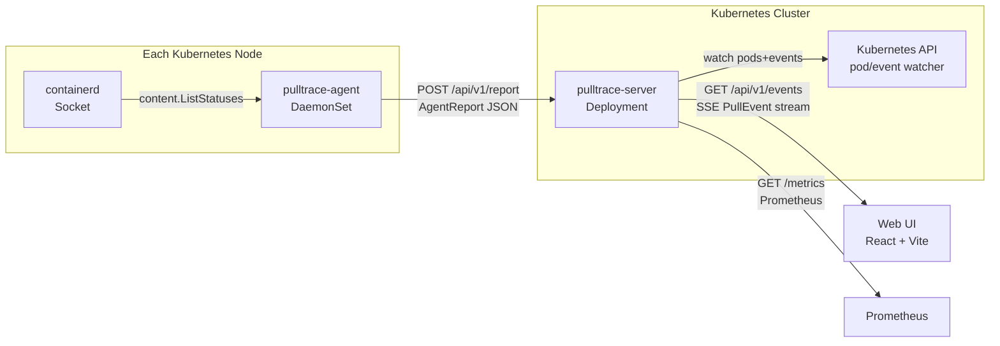

<objective>
Write full content for all 7 docs/ pages. Replace the stubs created in Plan 02-01 with production-ready documentation covering installation, configuration, architecture, Prometheus metrics, known limitations, and contributing. All content is sourced from README.md, CONTRIBUTING.md, source code env var tables from RESEARCH.md, and the Mermaid diagram pattern already validated in RESEARCH.md.

Purpose: The DOCS-02, DOCS-03, and DOCS-04 requirements can only be satisfied by real content. After this plan, a stranger can install and configure Pulltrace without reading source code.

Output: 7 fully written docs/ pages; live site verified by human after merge.
</objective>

<execution_context>
@/Users/jmaciejewski/.claude/get-shit-done/workflows/execute-plan.md
@/Users/jmaciejewski/.claude/get-shit-done/templates/summary.md
</execution_context>

<context>
@.planning/ROADMAP.md
@.planning/STATE.md
@.planning/phases/02-documentation-site/02-RESEARCH.md
@.planning/phases/02-documentation-site/02-01-SUMMARY.md
</context>

<tasks>

<task type="auto">
  <name>Task 1: Write installation, configuration, and architecture pages</name>
  <files>
    docs/installation.md
    docs/configuration.md
    docs/architecture.md
  </files>
  <action>
Write the three most critical docs pages. All data is in RESEARCH.md — copy exactly; do not invent values.

---

**docs/installation.md** — DOCS-02: must have helm repo add, helm install, prerequisites

```markdown
# Installation

## Prerequisites

- **Kubernetes 1.28+** with **containerd** runtime (CRI-O is not supported — Pulltrace reads the containerd gRPC socket directly)
- **Helm 3**
- A namespace with the `pod-security.kubernetes.io/enforce=privileged` label — the agent DaemonSet mounts the host containerd socket via `hostPath`, which requires a privileged pod security profile

## Install

```bash
# 1. Add the Pulltrace Helm repository
helm repo add pulltrace https://d44b.github.io/pulltrace/charts
helm repo update

# 2. Create the namespace with the required pod security label
kubectl create namespace pulltrace
kubectl label namespace pulltrace \
  pod-security.kubernetes.io/enforce=privileged --overwrite

# 3. Install Pulltrace
helm install pulltrace pulltrace/pulltrace \
  -n pulltrace
```

## Access the UI

```bash
kubectl port-forward -n pulltrace svc/pulltrace-server 8080:8080
```

Open [http://localhost:8080](http://localhost:8080) in your browser.

## Upgrade

```bash
helm repo update
helm upgrade pulltrace pulltrace/pulltrace -n pulltrace
```

## Uninstall

```bash
helm uninstall pulltrace -n pulltrace
```

## See Also

- [Configuration](configuration.md) — environment variables for server and agent
- [Architecture](architecture.md) — how Pulltrace works
```

---

**docs/configuration.md** — DOCS-03: all env vars for server and agent, with type and default

Source: RESEARCH.md "Code Examples" section — copy the tables exactly. Both tables have 6 variables.

```markdown
# Configuration

Pulltrace is configured entirely through environment variables. The Helm chart sets all required values automatically; the tables below are for reference when deploying outside Helm or overriding defaults.

## Server

The server is the central aggregator. It receives reports from agents, watches the Kubernetes API for pod correlation, and serves the web UI and SSE event stream.

| Variable | Type | Default | Description |
|----------|------|---------|-------------|
| `PULLTRACE_HTTP_ADDR` | string | `:8080` | HTTP listen address for the API and UI |
| `PULLTRACE_METRICS_ADDR` | string | `:9090` | Prometheus metrics listen address |
| `PULLTRACE_LOG_LEVEL` | string | `info` | Log level: `debug`, `info`, `warn`, `error` |
| `PULLTRACE_AGENT_TOKEN` | string | _(empty)_ | Shared token for agent authentication (optional; leave empty to disable auth) |
| `PULLTRACE_WATCH_NAMESPACES` | string | _(empty — all)_ | Comma-separated namespaces for pod/event correlation; empty means watch all namespaces |
| `PULLTRACE_HISTORY_TTL` | duration | `30m` | How long completed pulls remain visible in the UI |

## Agent

One agent DaemonSet pod runs on each node. It polls the local containerd socket and reports image pull progress to the server.

| Variable | Type | Default | Description |
|----------|------|---------|-------------|
| `PULLTRACE_NODE_NAME` | string | _(required)_ | Kubernetes node name; injected automatically via `fieldRef: spec.nodeName` |
| `PULLTRACE_SERVER_URL` | string | _(required)_ | URL of the Pulltrace server (e.g. `http://pulltrace-server:8080`) |
| `PULLTRACE_CONTAINERD_SOCKET` | string | `/run/containerd/containerd.sock` | Host path to the containerd gRPC socket |
| `PULLTRACE_LOG_LEVEL` | string | `info` | Log level: `debug`, `info`, `warn`, `error` |
| `PULLTRACE_AGENT_TOKEN` | string | _(empty)_ | Bearer token sent to the server; must match `PULLTRACE_AGENT_TOKEN` on the server if set |
| `PULLTRACE_REPORT_INTERVAL` | duration | `1s` | How often the agent polls containerd and sends a report to the server |

## Helm Values

When using the Helm chart, set environment variables via `values.yaml` overrides:

```yaml
server:
  env:
    PULLTRACE_LOG_LEVEL: debug
    PULLTRACE_HISTORY_TTL: 60m

agent:
  env:
    PULLTRACE_REPORT_INTERVAL: 2s
```

See `charts/pulltrace/values.yaml` in the repository for the full values reference.
```

---

**docs/architecture.md** — DOCS-04: Mermaid diagram + prose explaining data flow

Use the exact Mermaid diagram from RESEARCH.md Pattern 3 verbatim. The pymdownx.superfences custom fence configured in mkdocs.yml renders it natively with no extra packages.

```markdown
# Architecture

Pulltrace has three components: an agent DaemonSet, a central server, and a React web UI.

## Data Flow



## Components

### Agent (DaemonSet)

One agent pod runs on every node. It connects to the local containerd socket (`/run/containerd/containerd.sock` by default) and calls `content.ListStatuses` to enumerate active image layer downloads. Every second (configurable via `PULLTRACE_REPORT_INTERVAL`) it sends an `AgentReport` JSON payload to the server over HTTP.

### Server (Deployment)

The server is the single aggregation point. It:

1. Receives `AgentReport` payloads from all agents via `POST /api/v1/report`
2. Correlates image references with pod names by watching the Kubernetes pod and event APIs
3. Maintains an in-memory pull state map with a configurable TTL (`PULLTRACE_HISTORY_TTL`, default 30m)
4. Streams `PullEvent` updates to connected browsers via Server-Sent Events on `GET /api/v1/events`
5. Exposes Prometheus metrics on a separate port (`PULLTRACE_METRICS_ADDR`, default `:9090`)

### Web UI

A React single-page application served by the server at the root path. It establishes an SSE connection to `/api/v1/events` on load and renders live pull progress — per-node, per-image, per-layer — with ETA and download speed.

## API

| Endpoint | Method | Description |
|----------|--------|-------------|
| `/api/v1/report` | POST | Agent reports pull state; body is `AgentReport` JSON |
| `/api/v1/events` | GET | SSE stream of `PullEvent` messages for the UI |
| `/api/v1/pulls` | GET | Current pull state snapshot (used by UI on initial load) |
| `/metrics` | GET | Prometheus metrics (served on `PULLTRACE_METRICS_ADDR`) |
```

  </action>
  <verify>
    <automated>cd /Users/jmaciejewski/workspace/pulltrace && grep -q "helm repo add pulltrace" docs/installation.md && grep -q "PULLTRACE_HTTP_ADDR" docs/configuration.md && grep -q "PULLTRACE_NODE_NAME" docs/configuration.md && grep -q '```mermaid' docs/architecture.md && grep -q "flowchart LR" docs/architecture.md && echo "All three pages verified: install commands, env vars, mermaid diagram present"</automated>
    <manual>Read through installation.md and confirm a new user could install Pulltrace following it; check configuration.md has both server and agent tables</manual>
  </verify>
  <done>installation.md has helm repo add, helm install, kubectl label, port-forward commands and prerequisites. configuration.md has complete server table (6 rows) and agent table (6 rows). architecture.md has Mermaid flowchart with mermaid fence and prose for all three components.</done>
</task>

<task type="auto">
  <name>Task 2: Write prometheus, known-limitations, index, and contributing pages</name>
  <files>
    docs/prometheus.md
    docs/known-limitations.md
    docs/index.md
    docs/contributing.md
  </files>
  <action>
Write the remaining four pages. All metric data is from RESEARCH.md "Prometheus Metrics" table — 7 rows.

---

**docs/prometheus.md** — all 7 metrics from RESEARCH.md, types and descriptions

```markdown
# Prometheus Metrics

Pulltrace exposes Prometheus metrics on a separate port (default `:9090`, configured via `PULLTRACE_METRICS_ADDR`).

## Scrape Configuration

```yaml
scrape_configs:
  - job_name: pulltrace
    static_configs:
      - targets: ["pulltrace-server:9090"]
```

Or using Kubernetes service discovery with a `prometheus.io/scrape: "true"` annotation (the Helm chart sets this by default).

## Metrics Reference

| Metric | Type | Description |
|--------|------|-------------|
| `pulltrace_pulls_active` | Gauge | Image pulls currently in progress across all nodes |
| `pulltrace_pulls_total` | Counter | Total image pulls observed since server startup |
| `pulltrace_pull_duration_seconds` | Histogram | Pull duration in seconds (buckets: 1s, 5s, 10s, 30s, 1m, 2m, 5m, 10m) |
| `pulltrace_pull_bytes_total` | Counter | Total bytes downloaded across all pulls since server startup |
| `pulltrace_pull_errors_total` | Counter | Pulls that completed with a non-empty error field |
| `pulltrace_agent_reports_total` | Counter | Total agent report payloads received by the server |
| `pulltrace_sse_clients_active` | Gauge | Number of active SSE connections (browser UI clients) |

## Example Alert

```yaml
groups:
  - name: pulltrace
    rules:
      - alert: ImagePullErrors
        expr: increase(pulltrace_pull_errors_total[5m]) > 0
        for: 0m
        labels:
          severity: warning
        annotations:
          summary: "Image pull errors detected"
          description: "{{ $value }} pull error(s) in the last 5 minutes"
```
```

---

**docs/known-limitations.md**

```markdown
# Known Limitations

## containerd Only

Pulltrace reads the containerd gRPC socket directly. Nodes using CRI-O or Docker Engine (without containerd) are not supported.

## In-Memory State Only

Pull history is stored in-memory on the server with a configurable TTL (default 30 minutes). Restarting the server clears all pull history. There is no persistence layer.

## Single Cluster

One Pulltrace installation monitors one Kubernetes cluster. Multi-cluster federation is not supported in v0.1.0.

## No UI Authentication

The web UI is read-only and has no built-in authentication. It is designed for use behind an ingress controller with auth, within a private cluster network, or accessed via `kubectl port-forward`. Do not expose the UI directly to the public internet without an authentication proxy.

## Layer Events Not Streamed

The server maintains per-layer progress state internally, but SSE events for individual layer start/progress/completion events are not emitted in v0.1.0. Layer data is visible in the UI on each pull update cycle.
```

---

**docs/index.md** — replace the stub with a proper home page

```markdown
# Pulltrace

Real-time Kubernetes image pull progress monitor.

Pulltrace gives you live visibility into image pulls happening across your cluster nodes — layers, download speed, and ETA — in a single web UI.

## What It Does

When you deploy a new image to your cluster, Kubernetes schedules pods and nodes begin pulling image layers from the registry. This process is invisible by default: `kubectl get pods` shows `ContainerCreating` with no detail.

Pulltrace fills that gap. It runs a lightweight DaemonSet agent on each node that reads from the containerd socket, and a central server that aggregates the data and streams it to a browser UI.

## Key Features

- **Per-layer progress** — see which layers are downloading, their size, and download speed
- **ETA** — estimated time remaining based on current download rate
- **Multi-node** — all nodes in the cluster visible in one view
- **Pod correlation** — image references linked to pod names via the Kubernetes API
- **Prometheus metrics** — pull counts, durations, bytes, and error rates
- **Single `helm install`** — deploys as a DaemonSet + Deployment with a standard Helm chart

## Quick Start

See the [Installation](installation.md) page for the full install guide.

```bash
helm repo add pulltrace https://d44b.github.io/pulltrace/charts
helm repo update
helm install pulltrace pulltrace/pulltrace -n pulltrace --create-namespace
```

## Requirements

- Kubernetes 1.28+ with containerd runtime
- Helm 3
```

---

**docs/contributing.md** — keep concise; link to CONTRIBUTING.md in repo

```markdown
# Contributing

Thank you for your interest in contributing to Pulltrace.

## Getting Started

See [CONTRIBUTING.md](https://github.com/d44b/pulltrace/blob/main/CONTRIBUTING.md) in the repository root for:

- Development prerequisites (Go 1.22+, the Docker workaround for local machines with older Go)
- Build instructions (`make` and `docker build`)
- PR guidelines

## Reporting Issues

Open an issue on [GitHub](https://github.com/d44b/pulltrace/issues). Include your Kubernetes version, containerd version, and the Pulltrace version (`helm list -n pulltrace`).

## Architecture Overview

Before contributing, reading the [Architecture](architecture.md) page and the [Architecture Decision Records](adr/001-runtime-containerd.md) will give you context on why key design choices were made.
```

  </action>
  <verify>
    <automated>cd /Users/jmaciejewski/workspace/pulltrace && grep -q "pulltrace_pulls_active" docs/prometheus.md && grep -q "pulltrace_pull_errors_total" docs/prometheus.md && grep -q "In-Memory" docs/known-limitations.md && grep -q "containerd Only" docs/known-limitations.md && grep -q "helm repo add" docs/index.md && grep -q "CONTRIBUTING.md" docs/contributing.md && echo "All four pages verified"</automated>
    <manual>Read prometheus.md and confirm all 7 metrics are listed with correct types</manual>
  </verify>
  <done>prometheus.md has all 7 metrics with type and description. known-limitations.md covers containerd-only, in-memory state, single cluster, no auth, layer events. index.md has Quick Start with helm commands. contributing.md links to CONTRIBUTING.md in repo.</done>
</task>

<task type="checkpoint:human-verify" gate="blocking">
  <name>Checkpoint: Verify live documentation site</name>
  <action>Human verification required — Claude has completed all automated content writing. No further automated steps in this task.</action>
  <verify>
    <manual>
1. Check GitHub Actions: go to https://github.com/d44b/pulltrace/actions and confirm the "Docs" workflow ran green after the branch merged to main.

2. If the "Docs" workflow ran green but the site returns 404: Go to GitHub repo Settings > Pages. Set Source to "Deploy from a branch", branch = `gh-pages`, folder = `/ (root)`. Save. Wait ~60 seconds.

3. Browse https://d44b.github.io/pulltrace/ and verify:
   - Home page loads (not a 404)
   - Navigation shows: Installation, Configuration, Architecture, Prometheus Metrics, Known Limitations, Contributing, Architecture Decisions
   - Installation page has `helm repo add pulltrace https://d44b.github.io/pulltrace/charts`
   - Configuration page has both Server and Agent tables with all env vars
   - Architecture page renders the Mermaid flowchart diagram (not raw code)
   - Prometheus page lists all 7 metrics

4. If the Mermaid diagram shows as raw code block instead of rendering: superfences YAML indentation error in mkdocs.yml — fix the `pymdownx.superfences` custom_fences block and re-deploy.
    </manual>
    <automated>MISSING — live site verification requires human; automated checks run in Task 1 and Task 2 verify above</automated>
  </verify>
  <done>https://d44b.github.io/pulltrace/ loads and all 7 pages render correctly including Mermaid diagram; user types "approved"</done>
  <resume-signal>Type "approved" once the site is live and all pages look correct. If issues are found, describe them and the plan will be revised.</resume-signal>
</task>

</tasks>

<verification>
After both auto tasks complete (before checkpoint):

```bash
cd /Users/jmaciejewski/workspace/pulltrace

# Verify all 7 pages have real content (not just stubs)
for f in docs/index.md docs/installation.md docs/configuration.md docs/architecture.md docs/prometheus.md docs/known-limitations.md docs/contributing.md; do
  lines=$(wc -l < "$f")
  echo "$f: $lines lines"
done

# Check for stub placeholder text (should return empty)
grep -l "Content coming in v0.1.0 documentation update" docs/*.md && echo "STUBS REMAIN" || echo "All stubs replaced"

# Verify key content
grep -q "helm repo add pulltrace" docs/installation.md && echo "OK: install command"
grep -q "PULLTRACE_HTTP_ADDR" docs/configuration.md && echo "OK: server env vars"
grep -q "PULLTRACE_NODE_NAME" docs/configuration.md && echo "OK: agent env vars"
grep -q '```mermaid' docs/architecture.md && echo "OK: mermaid diagram"
grep -q "pulltrace_pulls_active" docs/prometheus.md && echo "OK: prometheus metrics"
```
</verification>

<success_criteria>
- All 7 docs/ pages have full content (no "coming in v0.1.0" stubs remaining)
- installation.md: helm repo add, helm install, kubectl label, port-forward commands present; prerequisites listed
- configuration.md: server table with 6 rows (PULLTRACE_HTTP_ADDR through PULLTRACE_HISTORY_TTL); agent table with 6 rows (PULLTRACE_NODE_NAME through PULLTRACE_REPORT_INTERVAL)
- architecture.md: Mermaid flowchart with ```mermaid fence, prose for all three components
- prometheus.md: all 7 metrics with type and description
- Human-verified: https://d44b.github.io/pulltrace/ loads, nav works, Mermaid diagram renders
</success_criteria>

<output>
After the checkpoint is approved, create `.planning/phases/02-documentation-site/02-02-SUMMARY.md` using the summary template. Include: files modified (list all 7), content decisions made, checkpoint outcome, and any Pages configuration step required.
</output>
