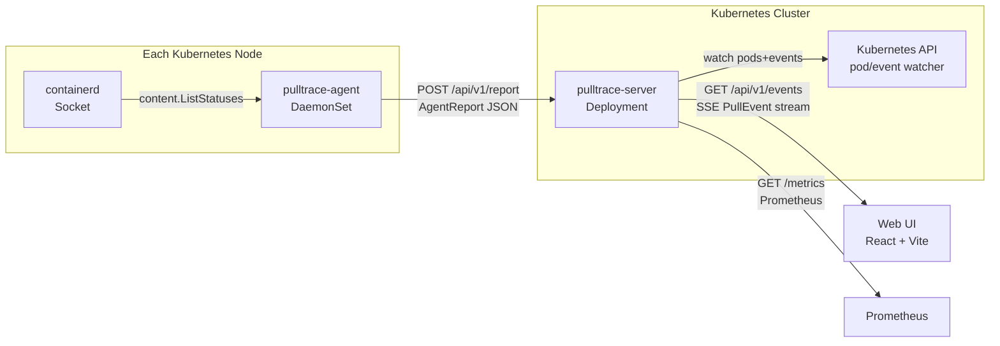

# Architecture

Pulltrace has three components: an agent DaemonSet, a central server, and a React web UI.

## Data Flow

## Components

### Agent (DaemonSet)

One agent pod runs on every node. It connects to the local containerd socket (`/run/containerd/containerd.sock` by default) and calls `content.ListStatuses` to enumerate active image layer downloads. Every second (configurable via `PULLTRACE_REPORT_INTERVAL`) it sends an `AgentReport` JSON payload to the server over HTTP.

### Server (Deployment)

The server is the single aggregation point. It:

1. Receives `AgentReport` payloads from all agents via `POST /api/v1/report`
2. Correlates image references with pod names by watching the Kubernetes pod and event APIs
3. Maintains an in-memory pull state map with a configurable TTL (`PULLTRACE_HISTORY_TTL`, default 30m)
4. Streams `PullEvent` updates to connected browsers via Server-Sent Events on `GET /api/v1/events`
5. Exposes Prometheus metrics on a separate port (`PULLTRACE_METRICS_ADDR`, default `:9090`)

### Web UI

A React single-page application served by the server at the root path. It establishes an SSE connection to `/api/v1/events` on load and renders live pull progress — per-node, per-image, per-layer — with ETA and download speed.

## API

| Endpoint | Method | Description |
|----------|--------|-------------|
| `/api/v1/report` | POST | Agent reports pull state; body is `AgentReport` JSON |
| `/api/v1/events` | GET | SSE stream of `PullEvent` messages for the UI |
| `/api/v1/pulls` | GET | Current pull state snapshot (used by UI on initial load) |
| `/metrics` | GET | Prometheus metrics (served on `PULLTRACE_METRICS_ADDR`) |
